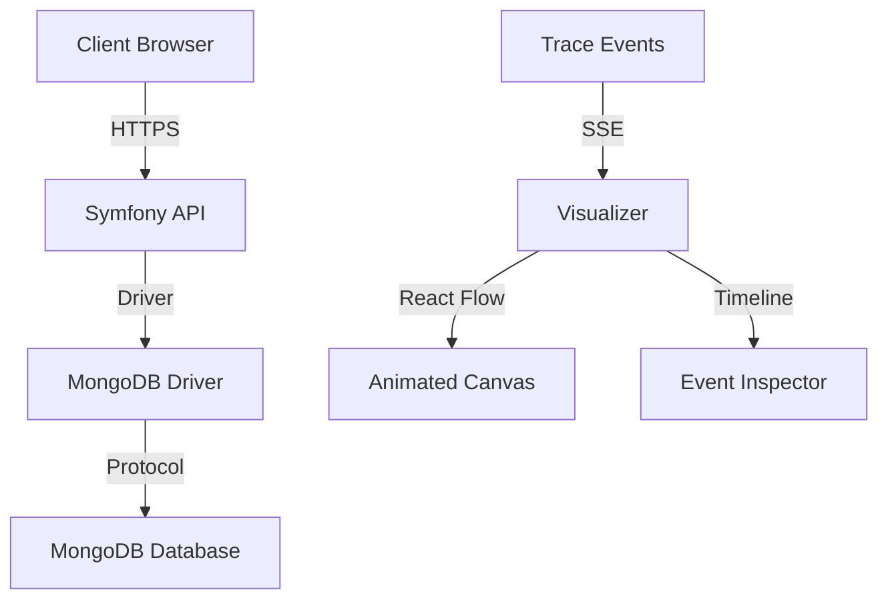

# Encryption Journey Visualizer

A real-time visualization tool that animates the flow of patient records through client-side encryption → transport → MongoDB Queryable Encryption → decryption. Built for SecureHealth.dev to demonstrate healthcare data security.


## 🚀 Features

- **Real-time Visualization**: Animated flow diagrams showing each step of the encryption journey
- **Queryable Encryption**: Visualize MongoDB's field-level encryption with query support
- **Role-based Access**: Simulate different user roles (Doctor, Nurse, Receptionist) and their field access
- **Interactive Timeline**: Step through events with play/pause/step controls
- **Field Inspector**: Detailed view of encryption modes and field samples
- **Embeddable**: Easy integration into Docusaurus docs and Symfony applications
- **Security First**: Built for healthcare compliance with signature verification

## 🏗️ Architecture



## 🛠️ Tech Stack

- **Frontend**: Next.js 14+ (App Router), TypeScript, Tailwind CSS
- **Visualization**: React Flow (@xyflow/react), Framer Motion
- **Data Fetching**: TanStack Query
- **Styling**: MongoDB-themed design system
- **Testing**: Playwright, ESLint, Prettier

## 📦 Installation

```bash
# Clone the repository
git clone https://github.com/your-org/encryption-journey.git
cd encryption-journey

# Install dependencies
npm install

# Start development server
npm run dev
```

Open [http://localhost:3000](http://localhost:3000) to view the application.

## 🎯 Usage

### Basic Usage

1. **Load Demo Session**: Click "Load Demo Session" on the homepage
2. **Navigate Timeline**: Use the sidebar timeline to jump between events
3. **Inspect Details**: Click on events to see detailed field information
4. **Control Playback**: Use play/pause/step controls in the header
5. **Toggle Views**: Switch between plaintext and ciphertext views

### Embedding

#### Docusaurus

```jsx
import EmbedFrame from '@site/src/components/EmbedFrame';

<EmbedFrame 
  sessionId="demo-session-001" 
  width="100%" 
  height={600} 
/>
```

#### Symfony TWIG

```twig
{{ render(controller('App\\Controller\\EmbedController::visualizer', {
    'sessionId': session_id,
    'width': '100%',
    'height': 600
})) }}
```

#### HTML iframe

```html
<iframe 
  src="https://encryption-journey.vercel.app/view/demo-session-001" 
  width="100%" 
  height="600" 
  frameborder="0" 
  allowfullscreen>
</iframe>
```

## 🔧 Configuration

### Environment Variables

```bash
# Optional: Symfony trace API base URL
NEXT_PUBLIC_TRACE_BASEURL=https://your-symfony-app.com

# Optional: Vercel deployment URL
NEXT_PUBLIC_VERCEL_URL=encryption-journey.vercel.app
```

### Customization

The visualizer can be customized through:

- **Colors**: Modify `src/lib/colors.ts` for different color schemes
- **Layout**: Adjust `src/lib/layout.ts` for different node arrangements
- **Phases**: Update `src/types/trace.ts` for different encryption phases
- **Roles**: Customize `src/components/Overlays/RoleLens.tsx` for different user roles

## 📊 Trace Event Schema

The visualizer consumes trace events with the following structure:

```typescript
interface TraceEvent {
  id: string;               // UUID v4
  sessionId: string;        // Groups events from single workflow
  ts: string;               // ISO 8601 timestamp
  phase: TracePhase;        // Encryption journey phase
  actor: TraceActor;        // System component
  verb: TraceVerb;          // Action performed
  dataset: string;          // Data type (patient, note, etc.)
  fields: TraceField[];     // Field encryption details
  payloadSizeBytes?: number; // Optional payload size
  meta?: Record<string, unknown>; // Additional metadata
  keyRef?: KeyReference;    // Key reference (never actual keys)
  signature: string;        // HMAC-SHA256 signature
}
```

See [docs/trace-schema.md](docs/trace-schema.md) for complete documentation.

## 🔐 Security

- **Signature Verification**: All events are verified using HMAC-SHA256
- **No Key Material**: Never handles actual encryption keys
- **CORS Protection**: Only allow-listed origins can consume events
- **Field Redaction**: Sensitive data is redacted in `visibleSample`
- **Production Safety**: Never logs event content in production

## 🧪 Testing

```bash
# Run Playwright tests
npm run test

# Run ESLint
npm run lint

# Run type checking
npm run type-check
```

## 🚀 Deployment

### Vercel (Recommended)

1. Connect your GitHub repository to Vercel
2. Set environment variables in Vercel dashboard
3. Deploy automatically on push to main branch

### Manual Deployment

```bash
# Build for production
npm run build

# Start production server
npm start
```

## 📁 Project Structure

```
src/
├── app/                    # Next.js App Router
│   ├── layout.tsx         # Root layout
│   ├── page.tsx           # Landing page
│   ├── view/[sessionId]/  # Visualizer route
│   └── api/               # API routes
├── components/
│   ├── Canvas/            # React Flow components
│   │   ├── FlowCanvas.tsx
│   │   ├── nodes/         # Custom node types
│   │   └── edges/         # Custom edge types
│   ├── Sidebar/           # Timeline and Inspector
│   ├── Overlays/          # Legend and RoleLens
│   └── EmbedFrame.tsx     # Embedding component
├── lib/                   # Utilities
│   ├── colors.ts          # Color system
│   ├── layout.ts          # Graph layout
│   ├── api.ts             # API client
│   └── sse.ts             # Server-sent events
└── types/
    └── trace.ts           # TypeScript definitions
```

## 🤝 Contributing

1. Fork the repository
2. Create a feature branch (`git checkout -b feature/amazing-feature`)
3. Commit your changes (`git commit -m 'Add amazing feature'`)
4. Push to the branch (`git push origin feature/amazing-feature`)
5. Open a Pull Request

## 📄 License

This project is licensed under the MIT License - see the [LICENSE](LICENSE) file for details.

## 🙏 Acknowledgments

- [MongoDB](https://mongodb.com) for Queryable Encryption
- [React Flow](https://reactflow.dev) for the visualization engine
- [Framer Motion](https://framer.com/motion) for animations
- [Next.js](https://nextjs.org) for the React framework
- [Tailwind CSS](https://tailwindcss.com) for styling

## 📞 Support

- **Documentation**: [docs/](docs/)
- **Issues**: [GitHub Issues](https://github.com/your-org/encryption-journey/issues)
- **Discussions**: [GitHub Discussions](https://github.com/your-org/encryption-journey/discussions)

---

Built with ❤️ for [SecureHealth.dev](https://securehealth.dev)
# encryption-journey
